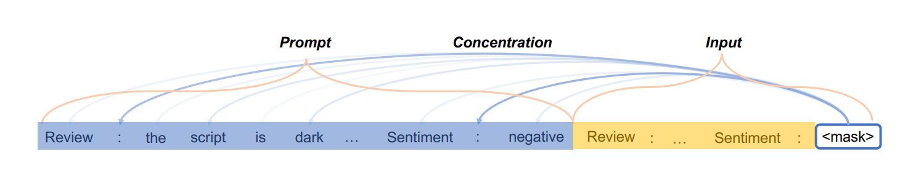

# Concentrate Attention: Towards Domain-Generalizable Prompt Optimization for Language Models
This repository contains code for *Concentrate Attention: Towards Domain-Generalizable Prompt Optimization for Language Models* (https://web3.arxiv.org/abs/2406.10584, NeurIPS 2024) by Chengzhengxu Li, Xiaoming Liu*, Zhaohan Zhang, Yichen Wang, Chen Liu, Yu Lan, Chao Shen. 

In this codebase we conduct pilot experiments and find that (i) Prompts gaining more attention weight from PLMs’ deep layers are more generalizable and (ii) Prompts with more stable attention distributions in PLMs’ deep layers are more generalizable. Thus, we offer a fresh objective towards domain-generalizable prompts optimization named ''Concentration'', which represents the ''lookback'' attention from the current decoding token to the prompt tokens, to increase the attention strength on prompts and reduce the fluctuation of attention distribution. 



We adapt this new objective to popular soft prompt and hard prompt optimization methods, respectively. Experiments demonstrate that our idea improves comparison prompt optimization methods by 1.42% for soft prompt generalization and 2.16% for hard prompt generalization in accuracy on the multi-source domain generalization setting, while maintaining satisfying in-domain performance. 

# Setting Up

Our codebase requires the following Python and PyTorch versions: 
* Python >= 3.8
* PyTorch >= 1.8.1 (install from the [official website](https://pytorch.org/get-started/locally/))

Install our core modules with
```
git clone https://github.com/czx-li/Concentrate-Attention.git
```
Train and save our modules
```
python main.py
```
## Citation

If you find our work helpful, please cite us with the following BibTex entry:

```
@article{li2024concentrate,
  title={Concentrate Attention: Towards Domain-Generalizable Prompt Optimization for Language Models},
  author={Li, Chengzhengxu and Liu, Xiaoming and Zhang, Zhaohan and Wang, Yichen and Liu, Chen and Lan, Yu and Shen, Chao},
  journal={arXiv preprint arXiv:2406.10584},
  year={2024}
}
```

Link to NeurIPS 2024 version paper: 
